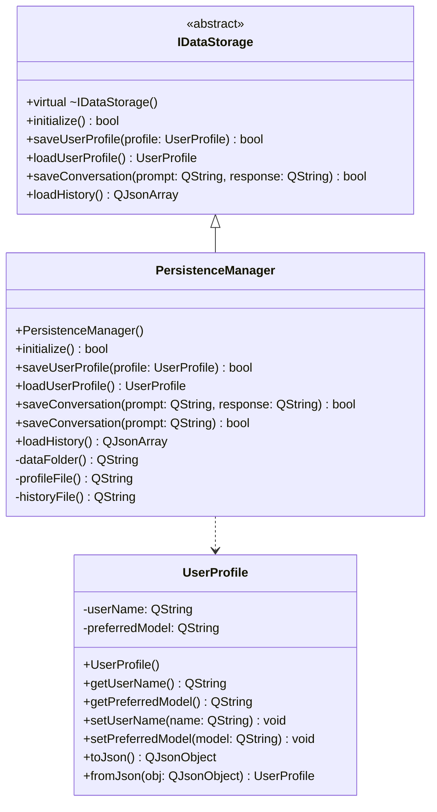

# Diagrama de clases UML

## Diagrama en formato Mermaid

## Argumentación del diseño

El diseño se hizo separando responsabilidades. Esto significa que cada clase tiene una función específica dentro del sistema.

La clase `UserProfile` se encarga únicamente de manejar los datos del usuario. Por eso tiene atributos privados como `userName` y `preferredModel`. Estos datos no se modifican directamente, sino usando métodos públicos como `setUserName` y `setPreferredModel`.

La clase `IDataStorage` es abstracta porque no representa un objeto concreto, sino una idea general de almacenamiento. Esta clase define qué operaciones debe tener cualquier sistema que quiera guardar datos.

La clase `PersistenceManager` hereda de `IDataStorage`. Esto permite usar herencia y también polimorfismo, porque el programa puede trabajar con un apuntador de tipo `IDataStorage*`, aunque realmente el objeto sea un `PersistenceManager`.

También se usa sobrecarga porque existen dos versiones del método `saveConversation`. Una versión recibe `prompt` y `response`, y otra versión solo recibe `prompt`. Esto permite guardar conversaciones de más de una forma.

Este diseño es adecuado porque permite que el sistema sea más flexible. Si en el futuro se quiere guardar la información en una base de datos en vez de archivos JSON, se podría crear otra clase que también herede de `IDataStorage`.
